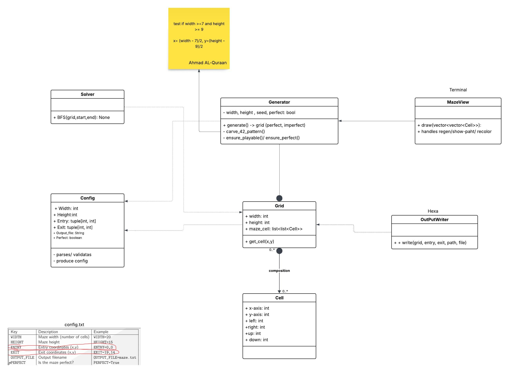
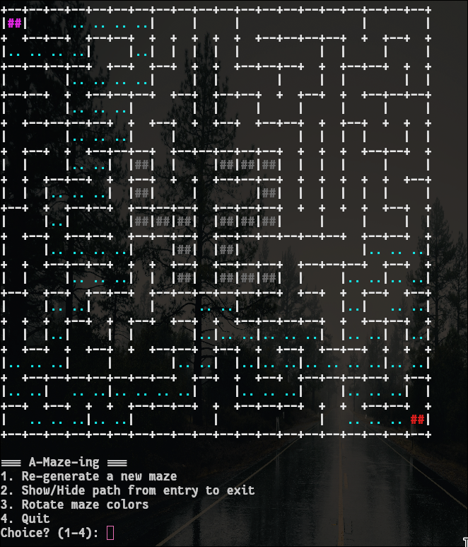
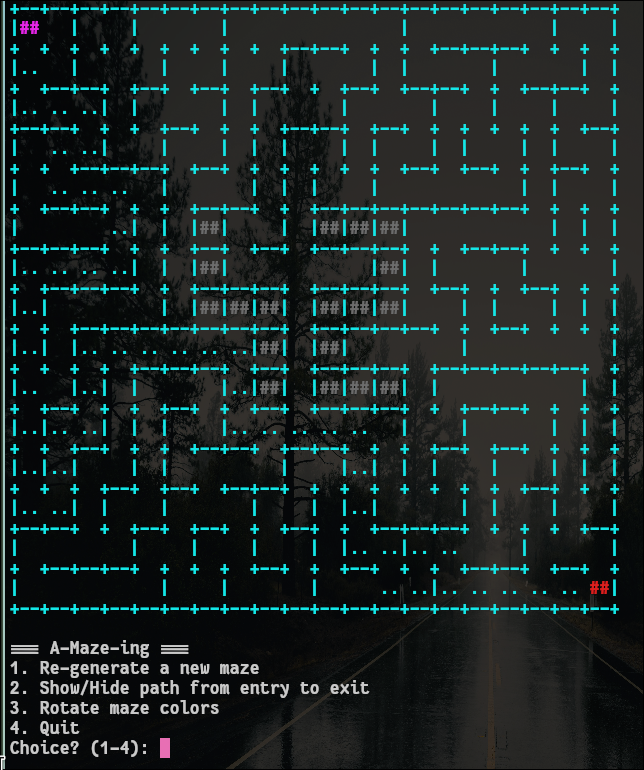
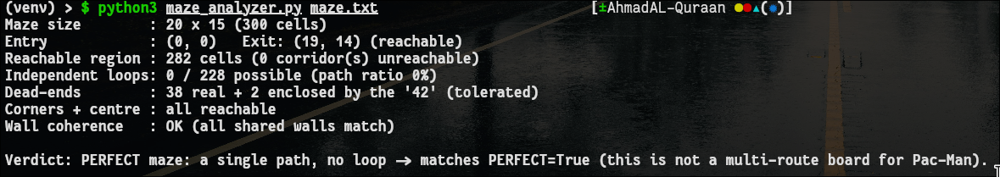
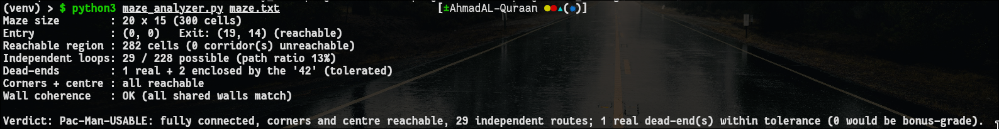

*This activity has been created as part of the 42 curriculum by Ahmad AL-Quraan and Alhareth Tahtamoni.*

## Description
This project aims to make a maze for pacman-like game.
A maze is either **perfect** or **imperfect**:
* Perfect maze: one path between any two nodes, with a lot of dead ends in the maze.
* Imperfect maze: At least two paths between any two nodes in the maze with minimum dead ends.


* Generated maze (perfect)


* Generated maze (imperfect)

## Instructions
To run the main program:
```bash
python a_maze_ing.py config.txt
```

### Reusable Maze Generator (`mazegen`)
This project includes a reusable maze generation library that can be installed via `pip`.
The package is built as a `.whl` file (`mazegen-1.0.0-py3-none-any.whl`).

**Installation:**
```bash
pip install mazegen-1.0.0-py3-none-any.whl
```

**Configuration example**:

```txt

WIDTH=20
HEIGHT=15
ENTRY=0,0
EXIT=19,14
OUTPUT_FILE=maze.txt
PERFECT=False
SEED=42
```

**Usage Example:**
```python
from mazegen.generator import Generator
from mazegen.grid import Grid
from config import Config # Your custom configuration structure

# 1. Instantiate and pass custom parameters (e.g. size, seed)
config = Config(width=15, height=15, entry=(0,0), exit=(14,14), output_file="", perfect=False)
generator = Generator(config)

# 2. Access the generated structure
grid: Grid = generator.generate()
cell = grid.get_cell(0, 0)
print(f"Cell 0,0 walls -> N:{cell.north}, E:{cell.east}, S:{cell.south}, W:{cell.west}")

# 3. Access at least a solution (shortest path)
from solver import bfs_solve
shortest_path = bfs_solve(grid, config.entry, config.exit)
print("Shortest Path Coordinates:", shortest_path)
```


## Algorithms
* **Perfect**: DFS with backtracking to make the perfect maze.
* **Imperfect**: uses the perfect algorithm but breaks extra walls by checking which cells have 1 open wall and breaks another one randomly using seed.
* **BFS algorithm** to find shortest path between entry and exit cells as requested in the task.

## Tasks 
- [x] Configuration file and format and error checking.
- [x] Perfect maze algorithm.
- [x] Imperfect maze algorithm.
- [x] Print and configure 42 Logo 
- [x] Makefile
- [x] Hexawriter
- [x] Shortest path between start and end.
- [x] Generating .whl file and pyproject.toml
- [x] README
- [x] Flake8 and mypy check 
- [x] Docstrings
- [x] Fixing Seed issue


## Debugging  

* Used `maze_analyzer.py` to check whether the generated maze is used by pacman or not.
* If perfect maze (not used by pacman):


* If Imperfect maze (used by pacman):

